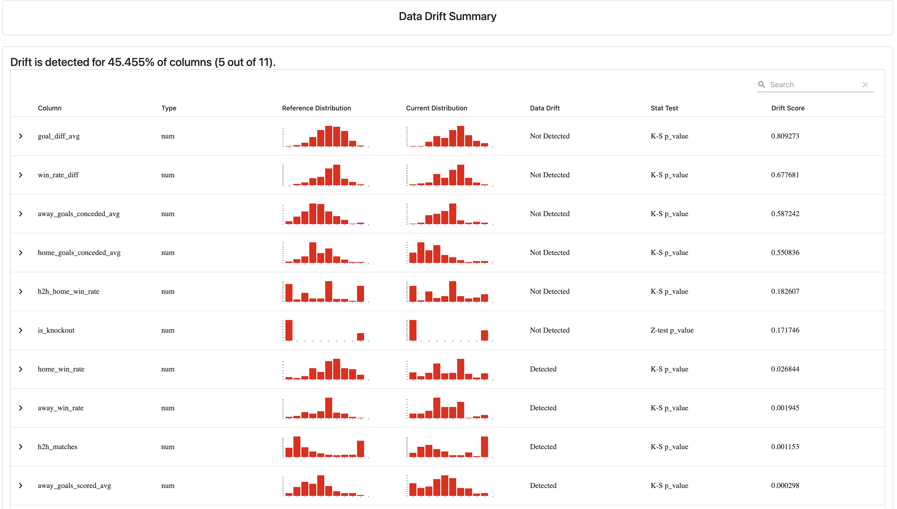

# ⚽ FIFA WC 2026 — Live Match Prediction System

> **End-to-end ML system that predicts FIFA World Cup 2026 match outcomes in real-time, simulates full tournament brackets using Monte Carlo methods, and updates predictions live as results come in — deployed and running during the actual tournament.**

[](https://wc2026-oracle.streamlit.app)
[](https://python.org)
[](https://fastapi.tiangolo.com)
[](https://docker.com)
[](https://github.com/ABHIRAMKATARI1289/FIFA-WC-2K26/actions)

---

## What Makes This Different

Most sports ML projects predict past tournaments on Kaggle data. This one:

- **Runs live during the actual 2026 World Cup** — predictions update after every real match result
- **3-layer architecture** — pre-match model → tournament simulator → live updater
- **Production-grade MLOps** — Docker, GitHub Actions CI/CD, Evidently AI drift monitoring
- **Deployed publicly** at [wc2026-oracle.streamlit.app](https://wc2026-oracle.streamlit.app)

---

## System Architecture

```
┌─────────────────────────────────────────────────────────────────┐
│                        DATA PIPELINE                            │
│  Kaggle WC Dataset + International Results (49,306 matches)     │
│                    ↓  src/etl.py                                │
│           Cleaned, Standardized → data/processed/               │
└─────────────────────────────────────────────────────────────────┘
                              ↓
┌─────────────────────────────────────────────────────────────────┐
│                    FEATURE ENGINEERING                          │
│  src/features.py — 20+ match-state features per game            │
│  • Team form (last 20 matches)  • Head-to-head win rate         │
│  • Goals scored/conceded avg    • Win rate differential         │
│  • Knockout stage flag          • Goal diff average             │
└─────────────────────────────────────────────────────────────────┘
                              ↓
┌─────────────────────────────────────────────────────────────────┐
│                    LAYER 1 — MATCH MODEL                        │
│  src/model.py — Logistic Regression + XGBoost                   │
│  • Time-based split (train: 1990–2010, test: 2014)              │
│  • Brier Score: 0.1555  |  Accuracy: 68.8% on WC 2014           │
│  • Calibrated probabilities for Win / Draw / Loss               │
└─────────────────────────────────────────────────────────────────┘
                              ↓
┌─────────────────────────────────────────────────────────────────┐
│                 LAYER 2 — TOURNAMENT SIMULATOR                  │
│  src/simulator.py — Monte Carlo (10,000 simulations)            │
│  • Simulates full 104-match bracket end-to-end                  │
│  • Outputs each team's probability of winning WC 2026           │
│  • Top prediction: Argentina 18.9%                              │
└─────────────────────────────────────────────────────────────────┘
                              ↓
┌─────────────────────────────────────────────────────────────────┐
│                  LAYER 3 — LIVE UPDATER                         │
│  src/updater.py — football-data.org API                         │
│  • Fetches real match results after each game                   │
│  • Re-runs simulator with actual scores locked in               │
│  • Tracks model accuracy against real outcomes                  │
└─────────────────────────────────────────────────────────────────┘
                              ↓
┌─────────────────────────────────────────────────────────────────┐
│              FASTAPI + STREAMLIT DASHBOARD                      │
│  api/main.py → /predict  /simulate  /live  /standings           │
│  dashboard/app.py → Live public dashboard                       │
└─────────────────────────────────────────────────────────────────┘
```

---

## Results

| Metric | Value |
|---|---|
| Model accuracy on WC 2014 (holdout) | **68.8%** |
| Brier Score | **0.1555** (vs 0.25 random baseline) |
| Monte Carlo simulations per run | **10,000** |
| Training matches | **440** (WC 1990–2014) |
| International results used for form | **49,306** |
| Features engineered | **20+** |
| Drift detected across WC eras | **5/11 features** |

---

## Features Used

| Feature | Description |
|---|---|
| `home_win_rate` | Team's win % in last 20 matches before this game |
| `home_goals_scored_avg` | Average goals scored, last 20 matches |
| `home_goals_conceded_avg` | Average goals conceded, last 20 matches |
| `away_win_rate` | Same for away team |
| `away_goals_scored_avg` | Same |
| `away_goals_conceded_avg` | Same |
| `h2h_home_win_rate` | Head-to-head historical win rate between these teams |
| `h2h_matches` | Number of historical matchups |
| `goal_diff_avg` | Net goal difference differential |
| `win_rate_diff` | Win rate gap between home and away |
| `is_knockout` | Group stage (0) vs knockout (1) — changes model behavior |

> **Key design decision:** All features are computed *as of the match date* using only data available before kickoff — preventing data leakage entirely.

---

## WC 2026 Predictions (Pre-Tournament)

| Rank | Team | Win Probability |
|---|---|---|
| 🥇 | 🇦🇷 Argentina | 18.9% |
| 🥈 | 🇪🇸 Spain | 13.1% |
| 🥉 | 🇧🇷 Brazil | 8.3% |
| 4 | 🇫🇷 France | 6.5% |
| 5 | 🇵🇹 Portugal | 6.3% |
| 6 | 🇩🇰 Denmark | 6.0% |
| 7 | 🏴󠁧󠁢󠁥󠁮󠁧󠁿 England | 4.6% |
| 8 | 🇰🇷 South Korea | 4.5% |

*Updated live as real match results come in during the tournament.*

---

## Model Monitoring (Evidently AI)



Drift analysis comparing WC football across eras (1990–2006 vs 2010–2014).
5/11 features show statistically significant drift, confirming that football has
changed structurally across decades — justifying the decision to train on 1990+ data only.

---

## Tech Stack

| Layer | Tools |
|---|---|
| Data pipeline | Python, pandas, NumPy |
| ML | scikit-learn, XGBoost, LightGBM |
| Simulation | Monte Carlo (custom), SciPy |
| API | FastAPI, Uvicorn, Pydantic |
| Dashboard | Streamlit, Plotly |
| Monitoring | Evidently AI |
| DevOps | Docker, GitHub Actions CI/CD |
| Live data | football-data.org API |

---

## Project Structure

```
FIFA-WC-2K26/
├── src/
│   ├── etl.py           # Data ingestion + cleaning pipeline
│   ├── features.py      # Feature engineering (20+ features)
│   ├── model.py         # Model training + evaluation
│   ├── simulator.py     # Monte Carlo tournament simulator
│   ├── updater.py       # Live result ingestion
│   └── monitoring.py    # Evidently drift detection
├── api/
│   └── main.py          # FastAPI REST API
├── dashboard/
│   └── app.py           # Streamlit dashboard
├── data/
│   ├── raw/             # Source CSVs (gitignored)
│   └── processed/       # Cleaned features + predictions
├── models/              # Trained model artifacts
├── reports/             # Evidently HTML reports
├── Dockerfile
├── .github/workflows/ci.yml
└── requirements.txt
```

---

## Run Locally

```bash
# Clone and setup
git clone https://github.com/ABHIRAMKATARI1289/FIFA-WC-2K26.git
cd FIFA-WC-2K26
python -m venv venv && source venv/bin/activate
pip install -r requirements.txt

# Run the pipeline
python src/etl.py
python src/features.py
python src/model.py
python src/simulator.py

# Start API
python -m uvicorn api.main:app --reload

# Start dashboard (new terminal)
streamlit run dashboard/app.py
```

---

## Run with Docker

```bash
docker build -t fifa-wc-2026 .
docker run -p 8000:8000 fifa-wc-2026
```

---

## API Endpoints

| Endpoint | Description |
|---|---|
| `GET /predict?home=Argentina&away=France` | Win/Draw/Loss probabilities |
| `GET /simulate?n=10000` | Run Monte Carlo tournament simulation |
| `GET /live` | Latest real match results |
| `GET /standings` | Current tournament win probabilities |
| `GET /teams` | All team stats |

---

## Author

**Katari Abhiram** — NITK Surathkal  
[GitHub](https://github.com/ABHIRAMKATARI1289)
